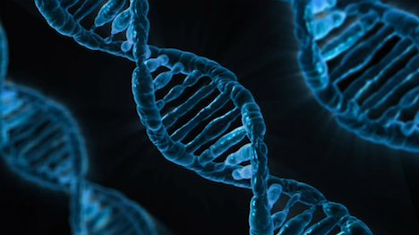
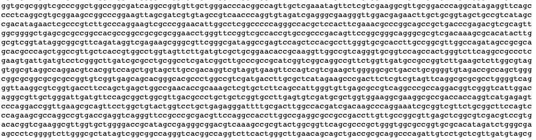
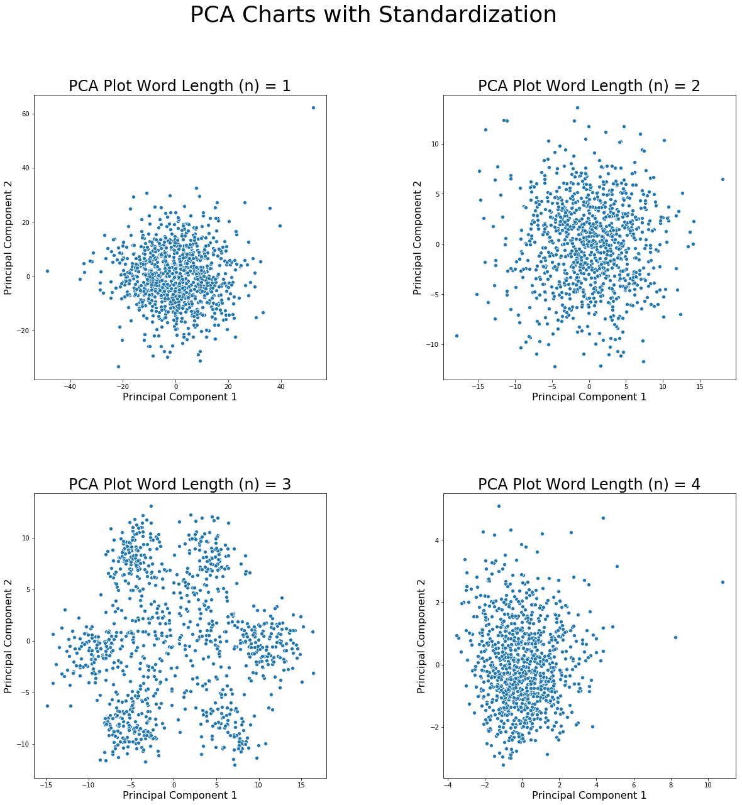
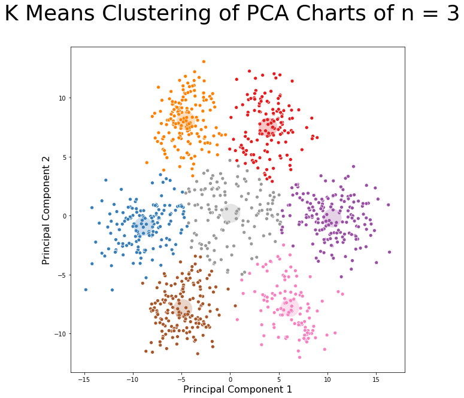
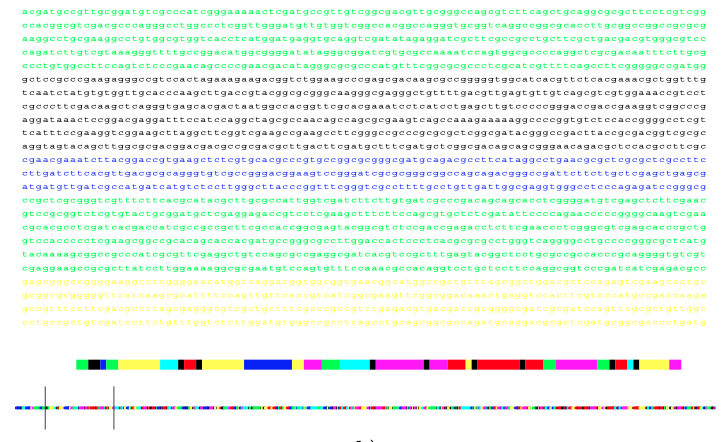

# Genome Deciphering with PCA and K-Means Clustering

Based on the attached PDF titled "14MainGorbanKeglWunschZin"

Given a sequence of the Caulobacter Crescentus bacteria genome, can we analyze the structure of the genetic code?

A fragment of the Caulobacter Crescentus genome looks like the below:

The genetic code is written as a series of nucleotides (A, T, G, C) and when sequenced together, contain the instructions for constructing the building blocks of life.

In this exercise, we are going to pretend that we don't know about codons, or the fact that genetic code is based on triplets of these nucleotides.

One strategy is to break the genome code in to smaller chunks and cluster them by different nucleotide "chain" lengths.  Here we will try up to chains of four nucleotides.

For example, a chain of length one would be either "A", "T", "G", "C"

A chain of length two would be like "AT", "GC", "AC", etc.

A chain of length three would be like "ATC", "GTA", etc.

A chain of length four would be like "ATGC"

We use PCA to identify the top two pricipal components of each test as the number of possible features grows exponentially and for easier visualization.

It is apparent that there are distinct clusters when using n=3 (aka codons).  There seems to be seven distinct clusters due to the fact that the codons might have been chunked off at one of three offsets, they can be read forwards, backwards, or be non-coding portions (3*2+1=7)

From here we can use K-Means clustering to identify and classify each point into it's respective cluster.

With the clusters identified and the code chunks classified, when returning back to the original genome, we can estimate which portions of the genome are similar based on how they are supposed to be read (forwards / backwards / offset / etc.)

The chunking of the original code was relatively arbitrary and the parameters could probably be adjusted for finer resolution of classifying the entire genome.

The next step would be parsing the data from the codons and determining what instructions they hold.